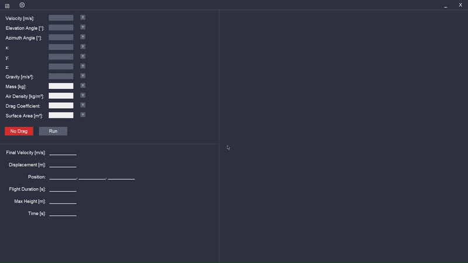

# A-Level-Project
Python program to simulate projectile motion in 3 dimensions.\
Developed for my Computer Science A-Level project.

## Installation
Use the package manager [pip](https://pip.pypa.io/en/stable/) to install the required packages.
```bash
pip install -r /path/to/requiremnets.txt
```

## Usage
This program allows the user to simulate projectile motion based on chosen initial conditions.
Includes definitions of key terms which are read from an external .txt file.
The effects of drag can be included/excluded, or both to show how it affects a projectile.

The program uses tkinter for the main GUI, and matplotlib to display the results. 
The appearance of the GUI can be changed by toggling colourblind mode and changing the theme.
The themes are stored in an external JSON file.


The program uses NumPy for the vector calculations. Due to the nature of the drag calculations, results 
including drag are only approximations.

### Presets
The program allows users to save presets to an external .db file. The GUI features a window
to manage the presets.\
The values can be previewed in the preset window and loaded into the entry fields in the main
window.



## Development
Written in Python 3.10.\
Currently in development.
Future updates will include:
<ul>
    <li>Additional themes
</ul>